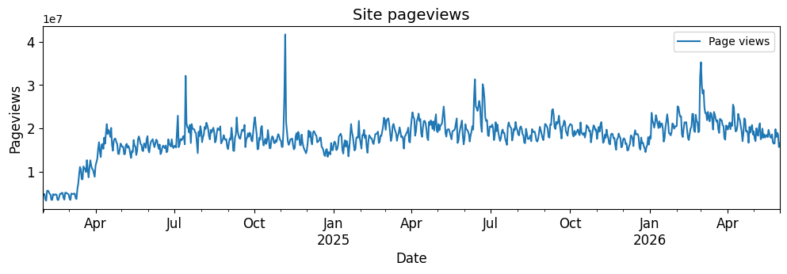
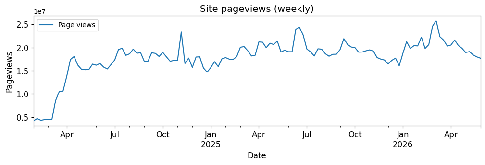
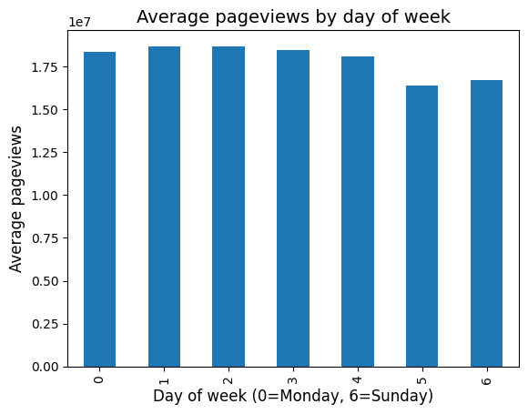
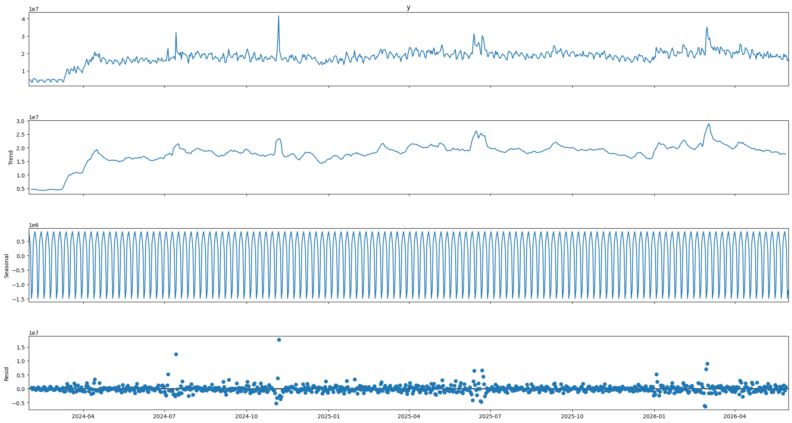
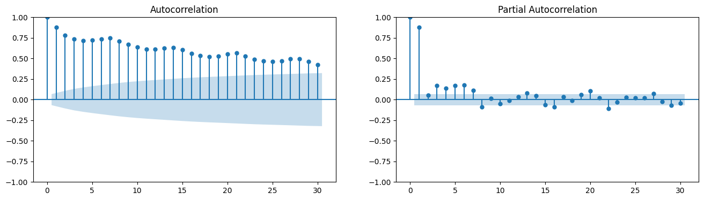
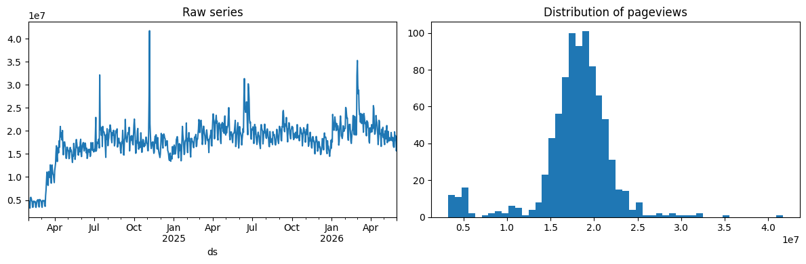
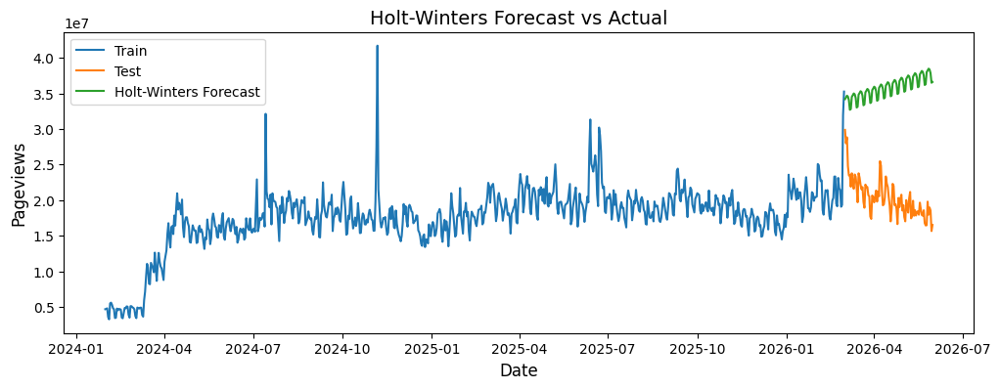
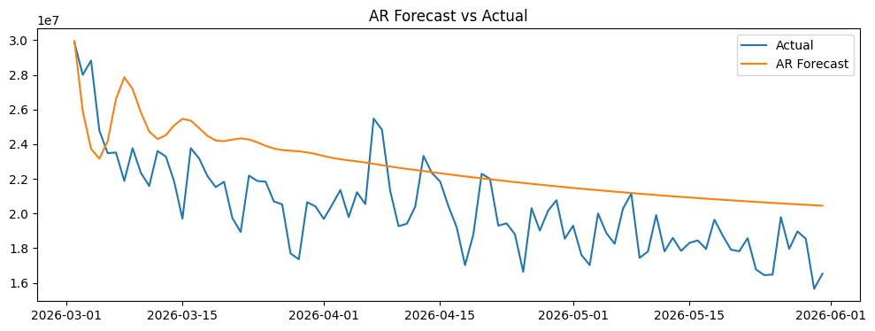
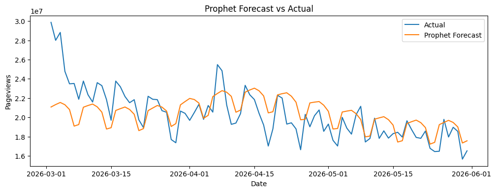
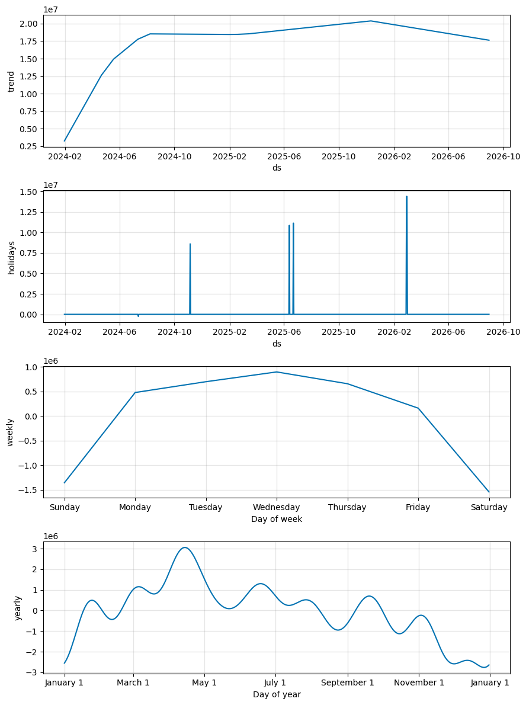

# Site Pageviews — Time Series Analysis

## Overview

This analysis applies three time series forecasting models to Site daily pageviews covering January 2024 to June 2026. The goal is to understand what drives traffic, identify breaking news effects, and find the most accurate forecasting model.

**Dataset:** Daily pageviews on the site  
**Period:** January 2024 – June 2026 (~850 daily observations)  
**Target:** Forecast the next 90 days of daily pageviews  
**Models tested:** Holt-Winters, Autoregressive (AR), Prophet

---

## 1. Data Loading

```python
import pandas as pd
import matplotlib.pyplot as plt

pageviews = pd.read_excel(
    "/Users/SubasRW1/Desktop/pageviews.xlsx",
    parse_dates=["Day"],
    index_col="Day"
)
```

**Column names:** `Day` (date index), `Page views` (daily traffic count).

Prophet requires columns named exactly `ds` and `y`, so rename early:

```python
df = pageviews.copy()
df = df.reset_index().rename(columns={"Day": "ds", "Page views": "y"})
```

---

## 2. Exploratory Data Analysis

### 2.1 Raw Time Series

**Why:** The first plot tells you what kind of series you're dealing with — is there a trend? Is it seasonal? Are there obvious outliers? You cannot choose the right model without seeing the raw data first.

```python
pageviews.plot(figsize=(12, 3), fontsize=12)
plt.title("Site pageviews")
plt.xlabel("Date")
plt.ylabel("Pageviews")
plt.savefig("images/01_raw_series.png", bbox_inches="tight")
plt.show()
```



**What you see:**
- Sharp growth from ~5M to ~20M between January and April 2024
- Stable plateau around 18–22M from mid-2024 onwards
- Clear weekly zigzag (weekday peaks, weekend dips) throughout
- Six visible spikes above 30M — these are breaking news events

---

### 2.2 Weekly Average

**Why:** The daily series is noisy. Resampling to weekly removes the day-to-day zigzag and makes the underlying trend and event spikes much clearer. It's a quick sanity check before investing time in modelling.

```python
weekly = pageviews.resample("W").mean()
weekly.plot(figsize=(12, 3), fontsize=12)
plt.title("Site pageviews (weekly average)")
plt.xlabel("Date")
plt.ylabel("Pageviews")
plt.savefig("images/02_weekly_average.png", bbox_inches="tight")
plt.show()
```



**What you see:** The trend structure becomes obvious — rapid growth in early 2024, plateau, and a gentle decline in 2026. The breaking news spikes stand out more clearly against the smoothed baseline.

---

### 2.3 Day of Week Pattern

**Why:** Understanding which days of the week are busiest tells you the shape of the weekly seasonality. This directly determines what `seasonal_periods` value to use in Holt-Winters and Prophet, and confirms whether a lag-7 AR model makes sense.

```python
pageviews["day_of_week"] = pageviews.index.dayofweek
pageviews.groupby("day_of_week")["Page views"].mean().plot(kind="bar")
plt.title("Average pageviews by day of week")
plt.xlabel("Day of week (0=Monday, 6=Sunday)")
plt.ylabel("Average pageviews")
plt.savefig("images/03_day_of_week.png", bbox_inches="tight")
plt.show()
pageviews = pageviews.drop(columns=["day_of_week"])
```



**What you see:** The pattern is much flatter than expected for a UK news site — only ~11% difference between weekdays and weekends. This confirms the traffic is predominantly **US-based**. Americans read news on weekends almost as much as weekdays, unlike UK/European audiences who have a sharp commuter-driven weekday peak.

---

### 2.4 Breaking News Spike Detection

**Why:** Spikes that are 2× or more above the normal level cannot be explained by trend or seasonality. If left unidentified, they corrupt model estimates — especially the trend in Holt-Winters. Identifying them upfront lets Prophet absorb them via the events DataFrame.

```python
pageviews[pageviews["Page views"] > 30_000_000]
```

| Date | Pageviews | Event |
|---|---|---|
| 2024-07-14 | 32,122,116 | Trump assassination attempt (Jul 13) — next day surge |
| 2024-11-06 | 41,701,591 | US Presidential Election results |
| 2025-06-13 | 31,329,220 | Air India plane crash — 260+ dead |
| 2025-06-22 | 30,195,035 | US strikes Iran nuclear sites |
| 2026-02-28 | 31,943,786 | US & Israel attack Iran — Day 1 |
| 2026-03-01 | 35,252,983 | US & Israel attack Iran — Day 2 |

---

## 3. Events DataFrame

**Why:** Prophet has a dedicated mechanism to handle one-off events. By passing a DataFrame of known event dates, the model learns the average traffic boost for each event type separately, keeps that effect out of the trend estimate, and applies it correctly in forecasts. Without this, breaking news spikes at the end of training corrupt the trend — as Holt-Winters demonstrated with a 86% error rate.

Different names for different event types matter — bank holidays suppress traffic while tube strikes boost it. If given the same name, Prophet averages the opposing effects and gets both wrong.

```python
events = pd.DataFrame({
    "ds": pd.to_datetime([
        "2024-07-13",    # Trump assassination attempt
        "2024-11-05",    # US Election day
        "2025-06-13",    # Air India plane crash - 260+ dead
        "2025-06-22",    # US strikes Iran nuclear sites
        "2026-02-28",    # US & Israel attack Iran - Day 1
        "2026-03-01",    # US & Israel attack Iran - Day 2
    ]),
    "holiday": [
        "trump_assassination_attempt",
        "us_election_2024",
        "air_india_crash",
        "us_iran_nuclear_strike",
        "us_israel_iran_attack",
        "us_israel_iran_attack",   # same name = same effect learned across both days
    ]
})
```

---

## 4. Preprocessing

### 4.1 Missing Dates Check

**Why:** Time series models assume a regular, gapless index. If a day is missing, the model treats the day before the gap and the day after as consecutive — making lag-based calculations wrong. You must find and fill gaps before fitting any model.

```python
all_dates = pd.date_range(start=df["ds"].min(), end=df["ds"].max(), freq="D")
missing_dates = all_dates.difference(df["ds"])
print("Missing dates:", len(missing_dates))
# Result: 0 — no gaps in the index
```

**Result:** No missing dates. Data is complete.

---

### 4.2 Missing Values Check

**Why:** Even if dates are all present, individual values may be NaN (failed data collection, system outage). NaN values cause most model fitting functions to fail or produce wrong results.

```python
print(df.isna().sum())
# ds    0
# y     0
```

**Result:** No missing values. No imputation needed.

---

### 4.3 Seasonal Decomposition

**Why:** Decomposition separates the series into three components — trend, seasonality, and residuals. This tells you exactly what structure the model needs to capture. If the trend panel drifts, you need trend handling. If the seasonal panel is consistent, `seasonal_periods=7` is reliable. If the residual panel has clear spikes, those are your outlier events.

```python
from statsmodels.tsa.seasonal import seasonal_decompose

ts = df.set_index("ds")["y"]
result = seasonal_decompose(ts, model="additive", period=7)
fig = result.plot()
fig.set_size_inches(22, 12)
plt.savefig("images/04_decomposition.png", bbox_inches="tight")
plt.show()
```



**Trend panel:** Sharp growth Jan–Apr 2024, stabilises ~20M from mid-2024. Breaking news spikes visible as bumps in the trend. Slight decline late 2025 into 2026. Series is non-stationary visually, but ADF test (below) overrides this.

**Seasonal panel:** Clean regular weekly cycle, amplitude ~1.5M, completely consistent throughout — never changes shape or size. Confirms `seasonal_periods=7` is the right value for Holt-Winters and Prophet.

**Residual panel:** Mostly flat near zero with clear outlier spikes matching the identified breaking news events. Residuals are not white noise — the events are real signals that need to be modelled explicitly.

---

### 4.4 ACF and PACF

**Why:** The ACF plot tells you whether autocorrelation exists and at which lags — this reveals the seasonality structure. The PACF strips out indirect chain effects and shows only direct dependencies, which tells you what AR order (p) to use. Without these plots, you're guessing the model order blindly.

```python
from statsmodels.graphics.tsaplots import plot_acf, plot_pacf

fig, axes = plt.subplots(1, 2, figsize=(16, 4))
plot_acf(ts, lags=30, ax=axes[0])
plot_pacf(ts, lags=30, ax=axes[1])
plt.savefig("images/05_acf_pacf.png", bbox_inches="tight")
plt.show()
```



**What the x-axis means:** Lag numbers — how many days back the correlation is measured. Lag 1 = yesterday, Lag 7 = same day last week, Lag 30 = 30 days ago.

**ACF (left):** All 30 lags significantly positive, slowly declining from ~0.85 to ~0.45. This slow gradual decay is the classic signature of a series dominated by trend or strong autocorrelation. Spike at lag 7 expected for weekly seasonality but masked by the overall autocorrelation strength.

**PACF (right):** Large spike at lag 1 (~0.9), smaller at lags 2–3, everything else inside the confidence band. Direct dependency is mostly at lag 1 — AR(1) or AR(2) captures most of the structure. `ar_select_order` confirmed lag 7 as optimal because the weekly same-day pattern is the most useful predictor.

---

### 4.5 Stationarity Test (ADF)

**Why:** AR and ARMA models require a stationary series — constant mean and variance over time. If the series has a trend, the coefficients learned early won't apply later. The ADF test formally checks this. If the series is non-stationary, differencing is needed before fitting. If it is stationary, differencing would actually hurt performance by introducing artificial structure.

```python
from statsmodels.tsa.stattools import adfuller

result = adfuller(ts.dropna())
print(f"ADF Statistic: {result[0]:.4f}")
print(f"p-value: {result[1]:.4f}")
```

**Result:**
```
ADF Statistic: -4.1013
p-value: 0.0009 → Series is STATIONARY
```

**Interpretation:** p-value = 0.0009, well below 0.05. Reject the null hypothesis of non-stationarity. The ADF test says the series IS stationary.

This overrides the visual impression from the ACF slow decay. The Jan–Apr 2024 ramp-up was a temporary growth phase, not a permanent trend — the series settled around 18–20M and stayed there. The mean is stable over time even though it grew initially.

**Important:** Do NOT apply `diff(7)` — over-differencing an already-stationary series destroys real signal and makes models worse.

---

### 4.6 Distribution Check

**Why:** The shape of the distribution tells you whether a transformation is needed before modelling. A heavily right-skewed distribution (long right tail) benefits from a log transform, which stabilises variance and makes the series more normally distributed. Checking kurtosis tells you how extreme the outliers are.

```python
fig, axes = plt.subplots(1, 2, figsize=(12, 4))
ts.plot(ax=axes[0], title="Raw series")
axes[1].hist(ts, bins=50)
axes[1].set_title("Distribution of pageviews")
plt.tight_layout()
plt.savefig("images/06_distribution.png", bbox_inches="tight")
plt.show()

print(f"Mean:     {ts.mean():,.0f}")
print(f"Std:      {ts.std():,.0f}")
print(f"Skewness: {ts.skew():.2f}")
print(f"Kurtosis: {ts.kurtosis():.2f}")
```



| Stat | Value | Interpretation |
|---|---|---|
| Mean | 17,896,758 | Average daily traffic across the full period |
| Std | 4,294,710 | 24% of mean — high variation from weekly cycle and breaking news |
| Skewness | -0.91 | Moderate left skew — early low-traffic ramp-up creates the left tail |
| Kurtosis | 4.46 | Heavy tails — election and assassination attempt days are extreme outliers |

**Skewness -0.91:** Negative means the left tail is longer — more extreme low values than high. Caused by Jan–Apr 2024 when traffic was 4–8M. Log transforms fix right (positive) skew, not left skew — applying one here would make things worse. Skewness between -1 and +1 is acceptable.

**Kurtosis 4.46:** Pandas returns excess kurtosis (normal = 0). Score of 4.46 means significantly heavier tails. This is caused by the breaking news spike days — confirmed as real signals, not data quality issues.

**Conclusion:** No transformation needed. Distribution is acceptable for all three models.

---

## 5. Train/Test Split

**Why:** In-sample predictions show how well the model fits data it already saw — this always looks better than real forecasting. To honestly evaluate forecast accuracy you must use data the model has never seen. For time series, the split must always be chronological — never random. A random split would let the model train on future data and test on the past, which is data leakage.

```python
train = df[df["ds"] < df["ds"].max() - pd.Timedelta(days=90)]
test  = df[df["ds"] >= df["ds"].max() - pd.Timedelta(days=90)]

print(f"Train: {len(train)} rows")  # 761
print(f"Test:  {len(test)} rows")   # 91
```

The test set covers March–June 2026, which includes the aftermath of the Iran attack spike — the hardest forecasting period in the dataset.

---

## 6. Model 1 — Holt-Winters Exponential Smoothing

**Why use it:** Holt-Winters handles trend and seasonality without requiring stationarity. It's fast, interpretable, and works well when the series has a stable seasonal pattern — which this series does (clean weekly cycle). It requires no event handling, no lag selection, and no preprocessing beyond the train/test split.

```python
from statsmodels.tsa.api import ExponentialSmoothing
from sklearn.metrics import mean_absolute_error

train_ts = train.set_index("ds")["y"]
test_ts  = test.set_index("ds")["y"]

tes = ExponentialSmoothing(
    train_ts,
    trend="add",         # additive trend — the trend adds a fixed amount each step
    seasonal="add",      # additive seasonal — the weekly swing is a fixed amplitude
    seasonal_periods=7   # one full seasonal cycle = 7 days
).fit()

tes_forecast = tes.forecast(len(test_ts))
mae_tes = mean_absolute_error(test_ts, tes_forecast)
print(f"Holt-Winters MAE: {mae_tes:.2f}")

plt.figure(figsize=(12, 4))
plt.plot(train_ts.index, train_ts.values, label="Train")
plt.plot(test_ts.index, test_ts.values, label="Test (actual)")
plt.plot(tes_forecast.index, tes_forecast.values, label="Holt-Winters Forecast")
plt.title("Holt-Winters Forecast vs Actual")
plt.legend()
plt.savefig("images/07_holtwinters.png", bbox_inches="tight")
plt.show()
```



**MAE: 15,464,162** — 86% error rate on a 17.9M average. The forecast went in completely the wrong direction.

**What went wrong:** The Iran attack days (Feb 28 – Mar 1 2026) caused a massive spike at the very end of the training data. Holt-Winters saw those final days as 30–35M and concluded the trend is now strongly upward. It has no events mechanism — it cannot distinguish a one-off spike from a genuine trend change. It extrapolated that spike as a new trend, forecasting ~36M by June 2026. The actual traffic was declining back to ~17M.

This result perfectly illustrates why Prophet was built — Holt-Winters is an excellent model on stable data but is fundamentally broken when breaking news spikes land at the end of training.

---

## 7. Model 2 — Autoregressive (AR)

**Why use it:** AR models predict the next value from a weighted combination of past values. They are the statistical foundation of time series forecasting and work well when the series has strong autocorrelation — which this series does (lag-1 PACF spike of 0.9). The `ar_select_order` function automates lag selection using BIC, removing the need to guess the model order.

```python
from statsmodels.tsa.ar_model import ar_select_order
from statsmodels.api import tsa

train_ts = train.set_index("ds")["y"]
test_ts  = test.set_index("ds")["y"]
train_ts = train_ts.asfreq("D")  # statsmodels requires declared frequency

mod = ar_select_order(train_ts, maxlag=14, ic="bic")
optlag = max(mod.ar_lags)
print("Optimal lag:", optlag)  # 7

ar = tsa.AutoReg(train_ts, lags=optlag)
ar_fit = ar.fit()

ar_pred = ar_fit.predict(
    start=len(train_ts),
    end=len(train_ts) + len(test_ts) - 1
)

mae_ar = mean_absolute_error(test_ts.values, ar_pred.values)
print(f"AR MAE: {mae_ar:,.2f}")

plt.figure(figsize=(12, 4))
plt.plot(test_ts.index, test_ts.values, label="Actual")
plt.plot(test_ts.index, ar_pred.values, label="AR Forecast")
plt.title("AR Forecast vs Actual")
plt.legend()
plt.savefig("images/08_ar_forecast.png", bbox_inches="tight")
plt.show()
```



**MAE: 2,642,868** — 15% error rate. Major improvement over Holt-Winters.

**Optimal lag = 7:** BIC selected last week's same-day value as the primary predictor. Monday this week is best predicted by last Monday — the weekly pattern is the dominant direct signal.

**What the plot shows:**
- Forecast correctly starts elevated (~29M) then gradually declines — gets the direction right
- Too smooth — misses the sharp weekly zigzag the actual data shows
- Systematically above the actual in the middle period — the Iran attack effect decays too slowly

**Why it still struggles:** No events mechanism. The Iran attack days inflate the starting forecast level. AR(7) captures the weekly cycle but produces a smoother output than the actual sharp swings. The actual traffic declines faster than the model expects as the news event effect fades.

---

## 8. Model 3 — Prophet

**Why use it:** Prophet is designed for exactly this type of data — business time series with multiple seasonalities, trend changepoints, and known one-off events. It decomposes the series into trend, seasonality, and holiday effects added together. The events DataFrame directly tells the model which days are special, so breaking news spikes never corrupt the trend estimate. No stationarity testing or differencing required.

```python
from prophet import Prophet

model = Prophet(
    holidays=events,           # breaking news events DataFrame
    weekly_seasonality=3,      # Fourier order 3 — smooth weekly curve
    yearly_seasonality=10,     # Fourier order 10 — captures yearly shape
    daily_seasonality=False    # no sub-daily patterns in daily data
)
model.fit(df)

future = model.make_future_dataframe(periods=91, include_history=True)
forecast = model.predict(future)

prophet_pred = forecast.set_index("ds")["yhat"].loc[test["ds"].values]
mae_prophet = mean_absolute_error(test["y"].values, prophet_pred.values)
print(f"Prophet MAE: {mae_prophet:,.2f}")

plt.figure(figsize=(12, 4))
plt.plot(test["ds"].values, test["y"].values, label="Actual")
plt.plot(test["ds"].values, prophet_pred.values, label="Prophet Forecast")
plt.title("Prophet Forecast vs Actual")
plt.legend()
plt.savefig("images/09_prophet_forecast.png", bbox_inches="tight")
plt.show()
```



**MAE: 1,674,411** — 9% error rate. Prophet wins.

**Why Prophet wins:**
- Events DataFrame correctly neutralised the Iran attack spike — trend estimate is clean
- Correctly starts the forecast at ~21M rather than ~29M (AR's inflated starting point)
- Explicit weekly seasonality captures the zigzag AR could only smooth over
- No preprocessing pipeline needed — handles trend and seasonality directly

---

### 8.1 Components Plot

**Why:** The components plot is more valuable than the forecast line for business insight. The forecast tells you what will happen. The components tell you why — you can quantify how much each factor (trend, weekly pattern, yearly pattern, each event) contributes to any given day's traffic.

```python
model.plot_components(forecast, uncertainty=False)
plt.savefig("images/10_prophet_components.png", bbox_inches="tight")
plt.show()
```



**Trend panel:**
- Rapid growth Jan–Aug 2024: site went from ~3M to ~18M in 8 months
- Plateau Aug 2024 – Jan 2026 at ~18–20M with slow continued growth
- Peak ~Jan 2026 at ~20M, then gradual decline
- Breaking news spikes are NOT in this line — correctly isolated to the holidays panel

**Holidays panel (event effect sizes above baseline):**
- Trump assassination attempt (Jul 2024): ~8.5M boost
- Air India crash (Jun 2025): ~11M boost
- Iran nuclear strike (Jun 2025): ~11M boost
- US & Israel attack Iran (Feb 2026): ~14.5M boost — the largest single event

**Weekly panel:**
- Wednesday is the peak (~+900K above baseline)
- Saturday and Sunday are the lowest (~-1.5M below baseline)
- Classic US mid-week news reading pattern — heaviest engagement on working days

**Yearly panel:**
- May is the strongest month (~+3M above baseline) — US political season
- January is weak (~-2.5M) — post-holiday slump
- November–December consistently lowest (~-2.5M to -3M)
- Multiple peaks through the year — US news cycle drives traffic more than weather or season

---

## 9. Final Model Comparison

| Model | MAE | Error rate | Key weakness |
|---|---|---|---|
| Holt-Winters | 15,464,162 | 86% | Iran spike corrupted trend — forecast went wrong direction entirely |
| AR | 2,642,868 | 15% | No events mechanism, over-smooth weekly pattern |
| **Prophet** | **1,674,411** | **9%** | **Winner — events DataFrame is the critical difference** |

---

## 10. Key Business Insights

| Finding | Implication |
|---|---|
| Site grew 6× in 8 months in 2024 | Strong initial audience acquisition phase now complete |
| Breaking news adds 8–14M pageviews per event | Events are the biggest single traffic driver — larger than seasonal effects |
| US Election added 41M pageviews in one day | Plan infrastructure capacity around major US political events |
| Mid-week traffic is 2.5M higher than weekends | Publish important content Tuesday–Thursday for maximum reach |
| May and July are peak months | Plan editorial capacity around these periods |
| Nov–Dec traffic drops ~3M below baseline | Holiday season is consistently weak — reduce publishing targets |
| Prophet beats AR by 37% | The events mechanism is the critical differentiator — always include known one-off events |

---

## 11. Preprocessing Summary

| Check | Result | Action |
|---|---|---|
| Missing dates | 0 gaps | None needed |
| Missing values | 0 nulls | None needed |
| Seasonal decomposition | Weekly cycle period=7, amplitude ~1.5M | seasonal_periods=7 confirmed |
| ACF/PACF | Strong lag-1 and lag-7 autocorrelation | AR(7) as starting point |
| Stationarity (ADF) | p=0.0009 — stationary | No differencing |
| Skewness | -0.91 (left skew) | No log transform |
| Kurtosis | 4.46 (heavy tails) | Handled via Prophet events DataFrame |
| Breaking news events | 6 identified | Added to Prophet events DataFrame |

---

## 12. How to Reproduce the Images

To generate and save all plots, add `plt.savefig("images/<filename>.png", bbox_inches="tight")` before each `plt.show()` call in the notebook. The `images/` folder is already created in the same directory as this file.
